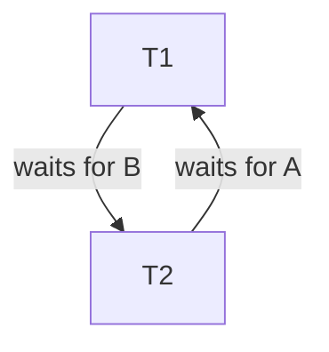

# UM6P Data Management Lab 7-part 2
## Part 1: Revisiting ACID Transactions

**Objective:** Identify which ACID property is satisfied or violated in the following MNHS scenarios.

### 1. Billing Service Crash & Recovery
* **Scenario:** A billing service records an Expense, crashes before updating the Insurance claim, and upon recovery, retries until both succeed.
* **Property Satisfied:** **Atomicity** and **Durability**.
* **Justification:**
    * **Atomicity:** The system ensures the "all-or-nothing" principle. By detecting the incomplete transaction and retrying, it prevents a partial update (where an expense exists without a claim update), ensuring the entire logical unit completes.
    * **Durability:** The fact that the system could recover its state after a crash implies that the transaction's intent or partial progress was durably stored (logged) before the crash.

### 2. Concurrent Appointment Booking
* **Scenario:** Two receptionists book the last slot concurrently; both get confirmation, but only one physical slot exists.
* **Property Violated:** **Isolation** (and consequently **Consistency**).
* **Justification:**
    * **Isolation Violation:** The transactions interfered with each other. One transaction did not properly "see" the other's activity (a race condition), leading to an incorrect view of available slots.
    * **Consistency Violation:** The database rule "only one physical slot exists" was broken because the system allowed two appointments for a single slot.

### 3. Shared Prescription List
* **Scenario:** Staff B views a patient's list while Staff A is entering medications. Staff B does not see the changes until Staff A commits.
* **Property Satisfied:** **Isolation**.
* **Justification:** This demonstrates proper isolation (specifically *Read Committed*). The system prevents "Dirty Reads," ensuring that Staff B only sees data that has been fully committed and is consistent, effectively isolating them from Staff A's temporary, uncommitted work.

### 4. Power Outage After Save
* **Scenario:** An admin saves a new patient and activity. A power outage occurs before the data is flushed to disk. Upon restart, the data is missing.
* **Property Violated:** **Durability**.
* **Justification:** Durability guarantees that once a transaction is committed (user receives "Save" confirmation), the changes must survive system failures like power outages. Since the committed data was lost, this property was violated.

### 5. Pharmacy Stock Logic
* **Scenario:** Stock quantity is reduced exactly by the dispensed amount regardless of concurrency, and never goes negative.
* **Property Satisfied:** **Consistency**.
* **Justification:** The system enforces business invariants (valid totals, no negative stock) regardless of concurrent execution. It ensures the database transitions from one valid state to another valid state, preserving data integrity.

---

## Part 2: Implementing Atomic Transactions in MySQL

**Objective:** Implement "all-or-nothing" behavior using MySQL transaction controls.

### 1. Atomic Scheduling of an Appointment
**Task:** Group the creation of a `ClinicalActivity` and an `Appointment` into a single transaction.

**(a) SQL Code Fragment**

```sql
START TRANSACTION;

-- 1. Create the ClinicalActivity row
INSERT INTO ClinicalActivity (CAID, IID, STAFF_ID, DEP_ID, Date, Time)
VALUES (101, 5, 20, 2, '2025-12-15', '09:00:00');

-- 2. Create the corresponding Appointment row
INSERT INTO Appointment (CAID, Reason, Status)
VALUES (101, 'General Checkup', 'Scheduled');

-- Control Logic:
-- If both statements succeed:
COMMIT;

-- If an error occurs (e.g., foreign key failure or constraint violation):
-- ROLLBACK;
```
 **(b) Explanation**

* **Atomicity:** Grouping these statements ensures Atomicity ("all or nothing"). The `START TRANSACTION` and `COMMIT`/`ROLLBACK` commands ensure that the database never ends up in a partial state where a `ClinicalActivity` exists without a corresponding `Appointment`.
* **Without Transaction (Autocommit):** If executed separately in autocommit mode, the first `INSERT` could succeed and the second could fail (e.g., due to a constraint violation or crash). This would leave "orphan" data in the database, violating data integrity.


### 2. Atomic update of stock and expense

**(a) Pseudocode**

```sql
START TRANSACTION
    TRY:
        UPDATE Stock SET Qty = Qty - dispensed_amount 
        WHERE medication_id = ...;
        
        -- Trigger logic typically runs automatically, but if manual:
        UPDATE Expense SET Total = calculated_new_total 
        WHERE activity_id = ...;
        
        COMMIT
    CATCH Error:
        ROLLBACK
```
**(b) Important Properties**

* **Atomicity:** Crucial to ensure that stock is not deducted without the expense being recorded (or vice versa).
* **Consistency:** Essential to ensure the invariants (Stock count matches reality, Expense matches dispensed items) remain valid.

## Part 3: Identifying Types of Schedules

**Context:**
* Transaction 1 ($T_1$): R(A), W(A)
* Transaction 2 ($T_2$): R(B), W(B)
* Schedule $S_1$: $R_1(A), R_2(B), W_1(A), W_2(B)$
* Schedule $S_2$: $R_1(A), W_1(A), R_2(B), W_2(B)$

### 1. Are the schedules $S_1$ and $S_2$ equivalent? Justify your answer.

**Answer:** Yes.

**Justification:**
Two schedules are **conflict equivalent** if they have the same operations and the order of all *conflicting* operations is the same.
* $T_1$ reads and writes item **A**.
* $T_2$ reads and writes item **B**.
* Because A and B are different data items, there are **no conflicting operations** between $T_1$ and $T_2$.
* When there are no conflicts, the operations can be swapped freely without changing the result. Therefore, the interleaved schedule $S_1$ is equivalent to the serial schedule $S_2$.

### 2. Is $S_1$ serializable? If yes, give an equivalent serial schedule.

**Answer:** Yes.

**Equivalent Serial Schedule:**
Since there are no conflicts, $S_1$ is equivalent to any serial order of the transactions.
* **Option A:** $T_1 \to T_2$ ($R_1(A), W_1(A), R_2(B), W_2(B)$)
* **Option B:** $T_2 \to T_1$ ($R_2(B), W_2(B), R_1(A), W_1(A)$)

---

## Part 4: Conflict Serializability

**Context:**
* $T_1$: R(A), W(A)
* $T_2$: W(A), R(B)
* $T_3$: R(A), W(B)
* Schedule $S_3$: $R_1(A), W_2(A), R_3(A), W_1(A), W_3(B), R_2(B)$

### 1. Construct the precedence (dependency) graph for $S_3$

To verify conflict serializability, we look for conflicting operations (Read-Write, Write-Read, Write-Write) on the same data item where the operation in one transaction precedes the other.

**Conflicts identified in Schedule $S_3$:**

1.  **Conflict on A ($R_1$ vs $W_2$):**
    * $R_1(A)$ occurs before $W_2(A)$.
    * **Edge:** $T_1 \to T_2$
2.  **Conflict on A ($W_2$ vs $R_3$):**
    * $W_2(A)$ occurs before $R_3(A)$.
    * **Edge:** $T_2 \to T_3$
3.  **Conflict on A ($W_2$ vs $W_1$):**
    * $W_2(A)$ occurs before $W_1(A)$.
    * **Edge:** $T_2 \to T_1$
4.  **Conflict on A ($R_3$ vs $W_1$):**
    * $R_3(A)$ occurs before $W_1(A)$.
    * **Edge:** $T_3 \to T_1$
5.  **Conflict on B ($W_3$ vs $R_2$):**
    * $W_3(B)$ occurs before $R_2(B)$.
    * **Edge:** $T_3 \to T_2$

**Resulting Precedence Graph (Text Representation):**
* Node $T_1$ has incoming edges from $T_2$ and $T_3$.
* Node $T_2$ has incoming edges from $T_1$ and $T_3$.
* Node $T_3$ has incoming edges from $T_2$.

**Visual Logic:**
* $T_1 \leftrightarrow T_2$ (Double arrow / Cycle)
* $T_2 \leftrightarrow T_3$ (Double arrow / Cycle)

### 2. Is $S_3$ conflict serializable? Justify your answer using the graph.

**Answer:** No.

**Justification:**
A schedule is conflict serializable **if and only if its precedence graph is acyclic** (contains no cycles). The graph for $S_3$ contains multiple cycles, which proves it is not serializable.

**Cycles present in the graph:**
1.  **Cycle 1 ($T_2$ and $T_3$):** We have an edge $T_2 \to T_3$ (due to conflict on A) and an edge $T_3 \to T_2$ (due to conflict on B).
2.  **Cycle 2 ($T_1$ and $T_2$):** We have an edge $T_1 \to T_2$ (due to $R_1$ before $W_2$) and an edge $T_2 \to T_1$ (due to $W_2$ before $W_1$).

Because these cycles exist, there is no valid serial order that respects all dependencies.


---

## Part 5: 2PL:

This section analyzes the following schedules to determine if they can be generated by a database system enforcing strict 2PL protocol.

**1-Schedule 1**

   **Schedule:**
      R1(A), W1(A), R1(B), W1(B), R2(A), W2(A)

   **Compatible with strict 2PL**: Yes

   **Justification:**
      T1 acquires locks on A and B during its growing phase and releases them only after completing all operations.
      T2 begins only after T1 has finished, so no lock is released before commit.
      Both transactions respect the growing and shrinking phases.


**2-Schedule 2**

   **Schedule:**
     R1(A), W1(A), R2(B), W2(B), R1(B)

   **Compatible with strict 2PL**: No

   **Justification:**
       T1 would need to acquire a lock on B after another transaction (T2) has already written B.
       This requires either acquiring a new lock after the shrinking phase has started or releasing a write lock before commit.


**3-Schedule 3**

   **Schedule:**
       R1(A), W1(A), R1(B), W1(B), R2(C), W2(C)

   **Compatible with strict 2PL**: Yes

   **Justification:**
       T1 and T2 access disjoint data items.
       Each transaction acquires all required locks during its growing phase and releases them only after completion.


**4-Schedule 4**

   **Schedule:**
       R1(A), W1(A), R2(A), W2(A), R1(B), R2(B), W2(B)

   **Compatible with strict 2PL:** No

   **Justification:**
       The interleaving forces a transaction to either release a write lock before commit or acquire new locks after entering the shrinking phase.
       This violates the strict separation of growing and shrinking phases required by strict 2PL.


---
   
## Part 6: Deadlocks in MNHS: 

## Question 1 – Wait-For Graph

**Schedule:**  
S = R1(A), R2(B), W1(B), W2(A)

### Analysis
- T1 acquires a lock on A.
- T2 acquires a lock on B.
- T1 requests B and waits for T2.
- T2 requests A and waits for T1.

### Wait-for Graph


### Conclusion

The wait-for graph contains a cycle between T1 and T2.
Therefore, the schedule results in a **deadlock**.

**Question 2 :Is there a deadlock?**: Yes

**Which transaction is waiting on which?**

-T1 is waiting for T2 to release lock on B

-T2 is waiting for T1 to release lock on A

**Where does the cycle appear?**

The cycle is: T1 → T2 → T1

**What the DBMS should do to resolve the deadlock?**:

-Detect the cycle in the wait-for graph.

-Select a victim transaction.

-Abort the victim transaction.

-Release its locks to allow the other transaction to proceed.
