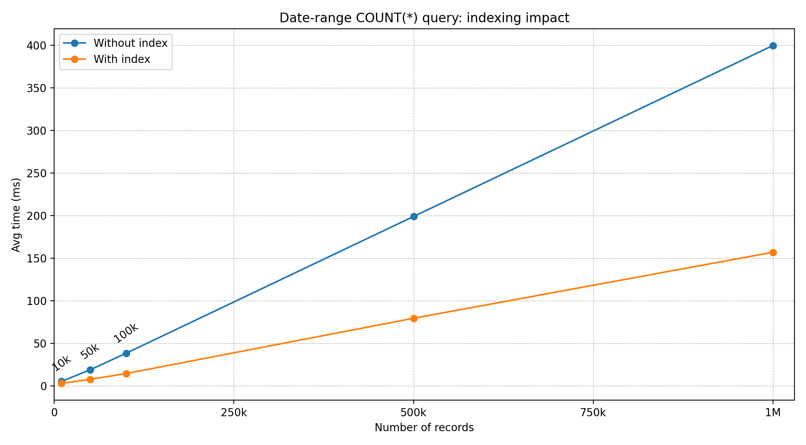

## Tablespaces and Storage Layout — Indexing Study Case (MySQL)

This study case empirically compares query execution plans and timings with and without a secondary index using MySQL `EXPLAIN`.

### Part 1 — EXPLAIN + Timing (ClinicalActivity + Appointment + Department)

#### Query

```sql
SELECT A.CAID, CA.Date, CA.Time, D.Name AS DepartmentName, A.Status
FROM Appointment A
JOIN ClinicalActivity CA ON CA.CAID = A.CAID
JOIN Department D ON D.DEP_ID = CA.DEP_ID
WHERE CA.Date BETWEEN '2025-11-15' AND '2025-11-30'
  AND A.Status = 'Scheduled';
```

#### Baseline (no additional index)

**EXPLAIN (baseline)**

| id | select_type | table | type   | possible_keys            | key     |   rows | filtered | Extra       |
| -: | ----------- | ----- | ------ | ------------------------ | ------- | -----: | -------: | ----------- |
|  1 | SIMPLE      | CA    | ALL    | PRIMARY,fk_ca_department | NULL    | 997545 |    11.11 | Using where |
|  1 | SIMPLE      | D     | eq_ref | PRIMARY                  | PRIMARY |      1 |      100 | Using index |
|  1 | SIMPLE      | A     | eq_ref | PRIMARY                  | PRIMARY |      1 |    33.33 | Using where |

**Observed timings (server-focused COUNT wrapper, seconds)**

To avoid client-side row transfer dominating the timings, the measurements used an equivalent server-side wrapper:

```sql
SELECT COUNT(*) AS Cnt
FROM (
  SELECT A.CAID, CA.Date, CA.Time, D.Name AS DepartmentName, A.Status
  FROM Appointment A
  JOIN ClinicalActivity CA ON CA.CAID = A.CAID
  JOIN Department D ON D.DEP_ID = CA.DEP_ID
  WHERE CA.Date BETWEEN '2025-11-15' AND '2025-11-30'
    AND A.Status = 'Scheduled'
) q;
```

* Run 1: 0.350059 s
* Run 2: 0.3497675 s
* Run 3: 0.361627 s
* Run 4: 0.358197 s
* Run 5: 0.3481305 s
* Average: ~0.3536 s (~353.6 ms)

**Interpretation (baseline)**

* Access path: `ClinicalActivity` is scanned with `type=ALL` (full table scan) and filtered by the date range.
* Join order: MySQL starts from `ClinicalActivity` (CA), then joins `Department` by PK (`eq_ref`), then joins `Appointment` by PK (`eq_ref`).
* Key observation: the date predicate on `ClinicalActivity.Date` has no usable index in the baseline plan, so the optimizer scans ~997k rows.

#### With one secondary index

**Index created**

```sql
CREATE INDEX idx_ca_date_caid ON ClinicalActivity (Date, CAID);
```

**EXPLAIN (with index)**

| id | select_type | table | type   | possible_keys                             | key              |  rows | filtered | Extra                 |
| -: | ----------- | ----- | ------ | ----------------------------------------- | ---------------- | ----: | -------: | --------------------- |
|  1 | SIMPLE      | CA    | range  | PRIMARY,fk_ca_department,idx_ca_date_caid | idx_ca_date_caid | 89184 |      100 | Using index condition |
|  1 | SIMPLE      | D     | eq_ref | PRIMARY                                   | PRIMARY          |     1 |      100 | Using index           |
|  1 | SIMPLE      | A     | eq_ref | PRIMARY                                   | PRIMARY          |     1 |    33.33 | Using where           |

**Observed timings (same COUNT wrapper, seconds)**

* Run 1: 0.1591 s
* Run 2: 0.1611 s
* Run 3: 0.1572 s
* Average: ~0.1591 s (~159.1 ms)

**Comparison summary (baseline vs indexed)**

* Access path:

  * Baseline: full scan on `ClinicalActivity` (`type=ALL`, ~997,545 rows) then joins to `Department` and `Appointment` by primary keys.
  * With index: range scan on `ClinicalActivity` (`type=range`) using `idx_ca_date_caid`, reducing the estimated examined rows to ~89,184.
* Join order: unchanged (`CA → D → A`), but the first step is much cheaper because the date range is applied through the index (`Using index condition`).
* Observed execution time: ~353.6 ms (no index) vs ~159.1 ms (with index).

  * Speedup: ~2.22× faster (~55% reduction).

---

### Part 2 — Visualizing the Impact of Indexing (Scaling Experiment)

Goal: measure how a date-range query filtering on `ClinicalActivity.Date` and `Appointment.Status` scales as table sizes grow (e.g., 10k → 1M rows), with and without a secondary index, then plot the results.

#### Query (range on Date + filter on Status)

```sql
SELECT COUNT(*) AS Cnt
FROM Appointment A
JOIN ClinicalActivity CA ON CA.CAID = A.CAID
WHERE CA.Date BETWEEN '2025-11-01' AND '2025-11-30'
  AND A.Status = 'Scheduled';
```

#### Table sizes and measurements

| Rows (ClinicalActivity/Appointment) | Avg time without index (ms) | Avg time with index (ms) |
| ----------------------------------: | --------------------------: | -----------------------: |
|                              10,000 |                        ~5.2 |                     ~2.9 |
|                              50,000 |                       ~18.9 |                     ~7.7 |
|                             100,000 |                       ~38.3 |                    ~14.5 |
|                             500,000 |                      ~198.9 |                    ~79.4 |
|                           1,000,000 |                      ~399.6 |                   ~156.9 |

Raw timings at 10,000 rows:

* Without index: 0.0053 s, 0.0052 s, 0.0051 s (avg ~0.0052 s)
* With index `idx_ca_date_caid (Date, CAID)`: 0.0032 s, 0.0027 s, 0.0027 s (avg ~0.0029 s)

Raw timings at 50,000 rows:

* Without index: 0.0188 s, 0.0188 s, 0.0190 s (avg ~0.0189 s)
* With index `idx_ca_date_caid (Date, CAID)`: 0.0081 s, 0.0071 s, 0.0079 s (avg ~0.0077 s)

Raw timings at 100,000 rows:

* Without index: 0.0367 s, 0.0406 s, 0.0377 s (avg ~0.0383 s)
* With index `idx_ca_date_caid (Date, CAID)`: 0.0156 s, 0.0148 s, 0.0130 s (avg ~0.0145 s)

Raw timings at 500,000 rows:

* Without index: 0.2071 s, 0.1977 s, 0.1919 s (avg ~0.1989 s)
* With index `idx_ca_date_caid (Date, CAID)`: 0.0984 s, 0.0692 s, 0.0707 s (avg ~0.0794 s)

Raw timings at 1,000,000 rows:

* Without index: 0.4348 s, 0.3841 s, 0.3799 s (avg ~0.3996 s)
* With index `idx_ca_date_caid (Date, CAID)`: 0.1772 s, 0.1459 s, 0.1475 s (avg ~0.1569 s)

#### Plot




#### Comment 

* As table size increases, indexing reduces the amount of data examined for the date range, lowering query time across all scales.
* The absolute time savings grows with table size (e.g., ~243 ms saved at 1,000,000 rows), showing that the index becomes increasingly valuable as the tables grow.
